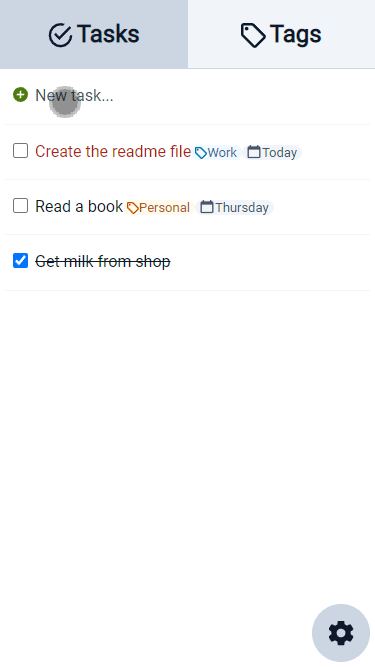

# A simple to-do list web app in Javascript

[Live preview](https://hg431.github.io/todo) 

## Features

- Intuitive app-like UI
- Tasks have deadlines, tags and importance
- Tags have names and colours
- Tasks can have multiple tags
- Tasks can be filtered by tags
- Local storage

Produced with: Figma, VSCode, webpack, date-fns